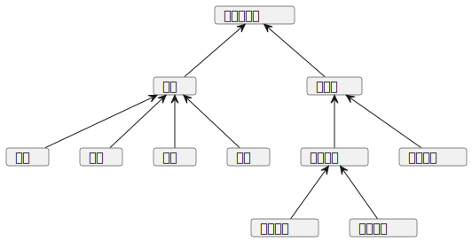

# 背景介绍
在桌面应用开发或者前端开发时，经常会遇到使用到图片的情况，那么使用到使用到图床或者文件下载站是必不可少的。
这时候就需要一个简单且高效的解决方案来管理个人图片集合。
传统的图片存储服务往往提供的功能过于复杂或者限制了用户对图片的控制权，并且并不会提供文件的直链，使用起来比较难受。
因此决定开发一个专门的图片下载站，旨在为个人用户以及开发者提供一个私人且易于访问的图片存储平台。

## 项目目标
1. **提供简洁易用的用户界面**：
    使用 Slint 框架开发前端，确保能够多端布局统一，使用GUI操作可以极大减少使用的难度。

2. **实现安全和高效的后端服务**：
   基于 Elysia 框架和 Drizzle ORM，搭建安全可靠的后端服务。
   这些技术不仅能够处理用户认证和权限管理，还能够有效地管理大量图片数据的存储和检索操作。

3. **使用可靠的数据库管理图片数据**：
    选择 PostgresQL 作为后端数据库，确保数据的稳定性和可靠性。
    PostgresQL 提供了丰富的功能，如事务处理和复杂查询，能够满足我们的数据管理需求。

4. **容器化部署和灵活的扩展性**：
    借助 Podman，我们将应用程序及其依赖项封装为容器，以便简化部署流程并提高应用的可移植性和安全性。这使得我们可以轻松地在不同环境中部署和扩展我们的图片下载站。

## 技术实现

- **前端开发**：
    - 使用 Slint, 构建响应式的用户界面，通过组件化和编译优化，实现高性能的图片上传和浏览体验。

- **后端开发**：
    - 基于 Elysia 框架搭建后端服务，处理用户认证、图片上传和存储请求。

- **数据库选择**：
    - 采用 PostgresQL 存储用户上传的图片和相关元数据。利用其支持的高级特性和稳定性，保证用户数据的安全和可访问性。

- **部署方案**：
    - 使用 Podman 管理容器化部署，将整个应用程序及其依赖项封装为独立的容器。这种部署方式不仅简化了开发团队的管理任务，还提升了应用的安全性和可维护性。

## 功能设计

**用户端**
- 能够对图片完成上传，下载，删除，重命名操作
- 能够配置图片是否分享

**管理员**
- 能够对普通用户进行管理
- 能够管理在数据库中的图片
