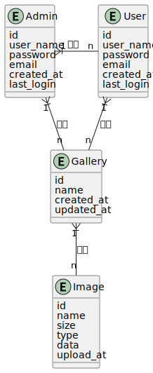

# 实体关系模式

## E.R. 实体关系图


## 关系模式
Admin 表
```
Admin (_id [primary key], user_name, password, email, created_at, last_login)
```

User 表
```
User (_id [primary key], user_name, password, email, created_at, last_login)
```

Gallery 表
```
Gallery (_id [primary key], name, created_at, updated_at, user_id [foreign key])
```

Image 表
```
Image (_id [primary key], name, size, type, data, upload_at, gallery_id [foreign key])
```

- *添加了 user_id 作为外键，以表示与 User 的关系。* 
- *添加了 gallery_id 作为外键，以表示与 Gallery 的关系。*
